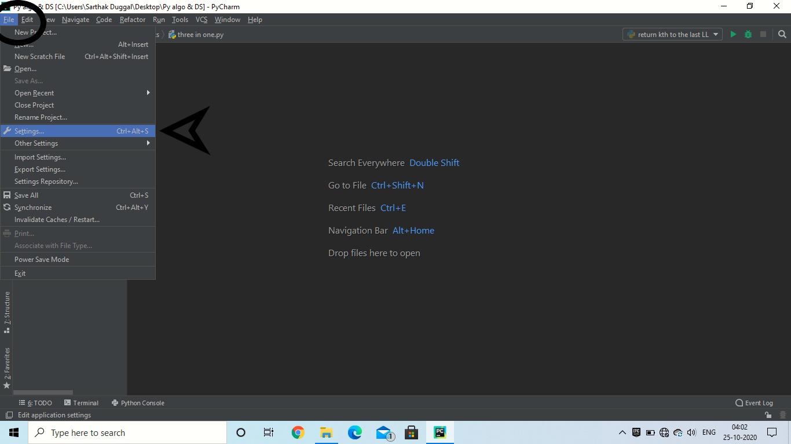
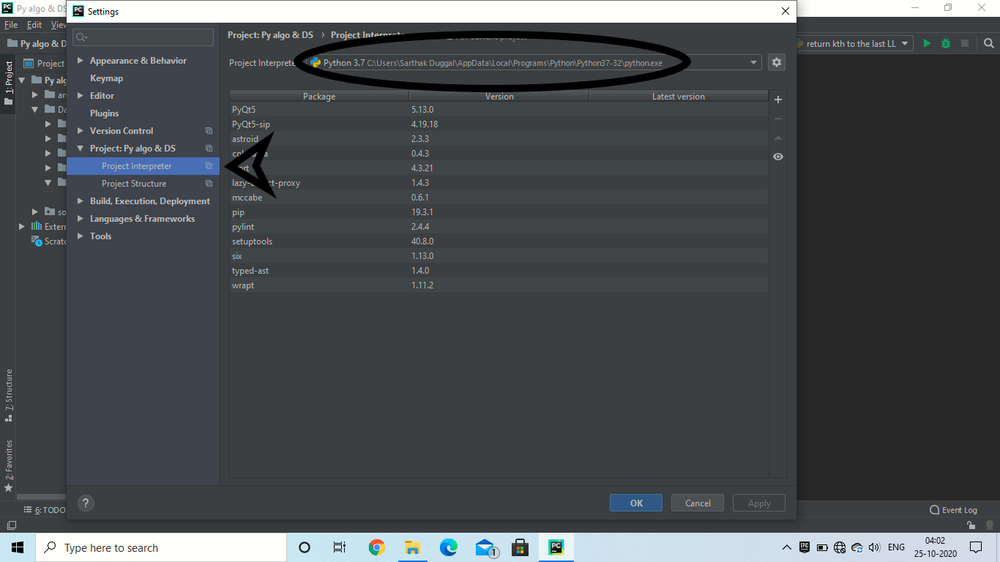

##### The _list.py_ file given in the root directory can be used as a **Template File** which can help you to solve competitive programming questions on _Linked List_ more easily.

##### Here, how you can use this file:-

**Note:-** **I will be using PyCharm as IDE.**

1. Create an empty Folder.
2. Open that folder in PyCharm
3. Go to **File** and then **settings** as shown below.

4. You will see a new popup window. In that go to **Project Interpreter** under **Project tab** as shown.

5. On the top, in the circle you will see the location of your project in your computer.
6. **Download the list.py** file from here and place it in the folder located in the location above.

#### Now, you can use this file by importing it in other files.

##### For an instance, create a new.py file in your **Project Folder** and try writing this on the top:- _from list import Singly_linked_list_ and now you can use all the methods defined in the list.py file without actually writing it out whole.
